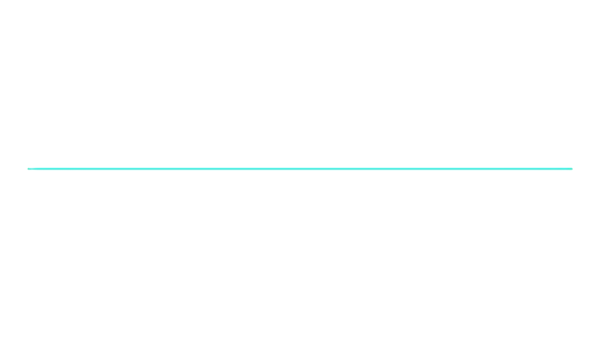

  
  

<h3 align="center">
  Front-End Developer
</h3>

  
  
   
  
  
  

 

## &nbsp;My Stack

## About me

-  Hello! My name is Rafael Yamanishi and I am a Front-End Developer.  
-  My goal is to finish my degree in Computer Science 
-  My main stack is JavaScript with Angular and NodeJs. 

